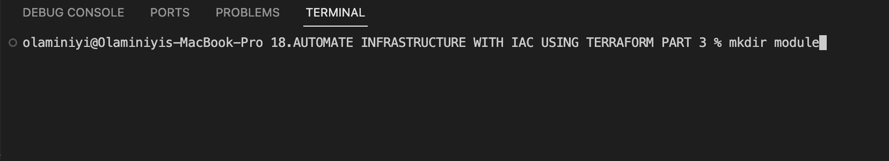
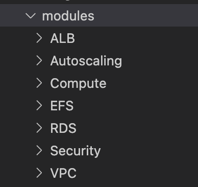
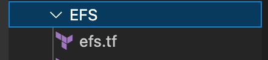
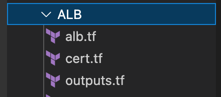
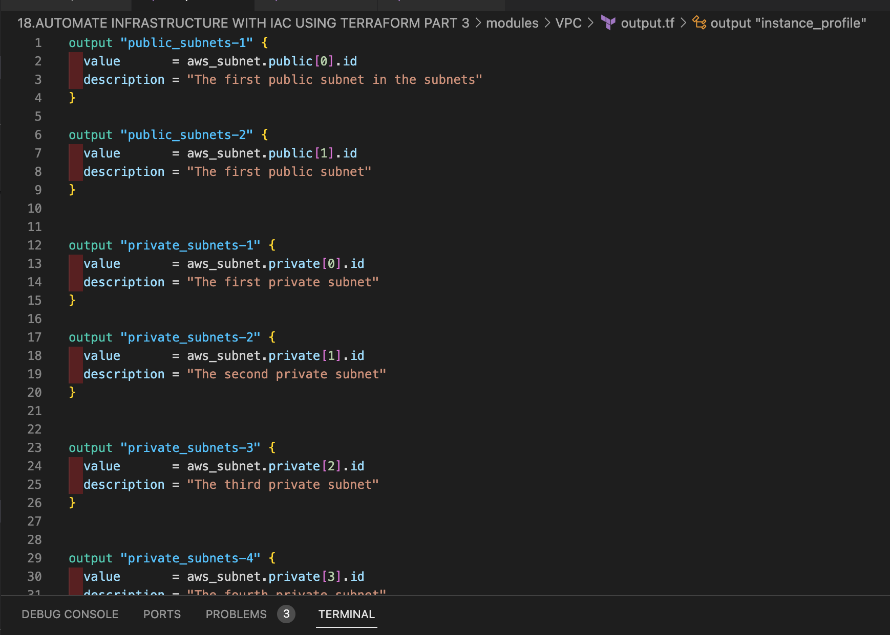

# AUTOMATE INFRASTRUCTURE WITH IAC USING TERRAFORM. PART 3 – REFACTORING
# steps for the entire project
1. VPC
2. Subnets
3. internet gateway
3. Elastic IP (depend on internet gateway)
4. Nat gateway (depend on IP, Internet gateway )
5. Route table 
6. Route, Route table assocation
7. create a certificate from certificate manager before Route table
8. create security group before the ALB
    - for the reverse proxy, you only specify security group for egress which is outband
    - you can now create a aws security group rule and attached it the security groupid 
    - we need security group rule when we want to referencing another security group group rule
9. Application Load balancer
10. Target Group
11. IaM and Roles (Create AssumeRole)
12. create Launch template (must be existing before Auto G) and
13. Autoscaling group
    13.1. bastion.sh
    13.2. nginx.sh
    13.3. tooling.sh
    13.4. wordpress.sh
    
14. Elastic File system 
=====================================================================
Proj 18

15. # create a module directory
    - mkdir modules

- create main.tf file in the root module
- create provider.tf file in the root module

-  cd in to modules
    - mkdir VPC ALB  Autoscaling EFS RDS Compute Security # create VPC, ALB Auto, EFS, RDS, security and compute directory directory

# we want to start moving resources into folder
    - anythng that is related to networking will be move to the VPC
    - move the main, route, roles, nat-gw, internet-gw into the module/VPC folder

    - move rds.tf to RDS
    

    - mv efs.tf module/EFS/
    

    - mv alb.tf cert.tf outputs.tf modules/ALB/
    

    - move security.tf to Security module
 

    - mv bastion.sh nginx.sh asg-bastion-nginx.tf asg-webserver.tf tooling.sh wordpress.sh modules/Autoscaling/

#
- move the provider block from maint.tf in the VPC to the provider.tf at the root folder
- for every modules, it must have a file called variable.tf

- in each module every argument is supposed to be declared as variable
- create an output.tf file in VPC module

- create dynamoDB to store the statefile-lock file and S3 bucket for storage on AWS
-  respectively in the main.tf file in root folder
- create a file backend.tf to configure our s3 bucket that store our statefile in a remote storage