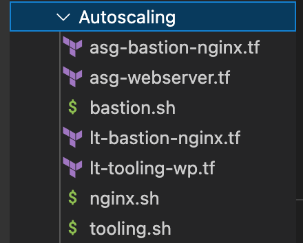

# USING TERRAFORM IAC TOOL TO AUTOMATE AWS CLOUD SOLUTION FOR 2 COMPANY WEBSITES (REFACTORING) - CONTINUATION

In two previous projects, we developed AWS Infrastructure code using Terraform and tried to run it from our local workstation. In this project,we will introduce some more advanced concepts and enhance the code.

We will explore alternative Terraform backends. A backend defines where Terraform stores its state data files **terraform.tfstate file**.

Terraform uses persisted state data to keep track of the resources it manages. Most non-trivial Terraform configurations either integrate with Terraform Cloud or use a backend to store state remotely. This lets multiple people access the state data and work together on that collection of infrastructure resources.

### REFACTORING THE CODE USING MODULES

We will be refactoring our codes to use modules and move the terraform.tfstate file to the S3 bucket in the cloud.

**Modules** serve as containers that allow to logically group Terraform codes for similar resources in the same domain (e.g., Compute, Networking, AMI, etc.). `One root module` can call other child modules and insert their configurations when applying Terraform config. This concept makes the code structure neater, and it allows different team members to work on different parts of configuration at the same time.

First we create a directory named narbyd-project which will be the root-modules inside the root-module we create a directory named modules.

 # create a module directory
    - mkdir modules


Inside the modules directory, we create the directories that will hold the diiferent resources eg **ALB, VPC, ASG, SECGRP, RDS, EFS** and also the compute directory.

Copy the files containing the resources that was created in [PROJECT-17](https://github.com/Olaminiyi/Project-17) into each of the folders created as related to the resources.

- create main.tf file in the root module
- create provider.tf file in the root module


-  cd in to modules
- mkdir VPC ALB  Autoscaling EFS RDS Compute Security # create VPC, ALB Auto, EFS, RDS, security and compute directory directory


### we want to start moving resources into folder
- anythng that is related to networking will be move to the VPC
- move the main, route, roles, nat-gw, internet-gw into the module/VPC folder


- move rds.tf to RDS

    

- mv efs.tf module/EFS/

  

- mv alb.tf cert.tf outputs.tf modules/ALB/

 

- move security.tf to Security module

 

```
mv bastion.sh nginx.sh asg-bastion-nginx.tf asg-webserver.tf tooling.sh wordpress.sh modules/Autoscaling/
```



- move the provider block from maint.tf in the VPC to the provider.tf at the root folder
- for every modules, it must have a file called variable.tf


- in each module every argument is supposed to be declared as variable
- create an output.tf file in VPC module


```
terraform init
```
```
terraform validate
```
```
terraform fmt
```
```
terraform plan
```
```
terraform apply
```


Below are some of the resources created


### Introducing Backend on S3

So far in this project, we have been using the default backend which is the local backend – it requires no configuration and the states file is stored locally. This mode is not a robust solution, so it is better to store it in some more reliable and durable storage.

The problem with storing this file locally is that, in a team of multiple DevOps engineers, other engineers will not have access to a state file stored locally on your computer.

To solve this, we will need to configure a backend where the state file can be accessed remotely by other DevOps team members. There are plenty of different standard backends supported by Terraform that you can choose from. Since we are already using AWS – we can choose an S3 bucket as a backend.

Another useful option that is supported by S3 backend is [State Locking](https://developer.hashicorp.com/terraform/language/state/locking)-it is used to lock your state file for all operations that could write state. This prevents others from acquiring the lock and potentially corrupting your state. State Locking feature for S3 backend is optional and requires another AWS service – [DynamoDB](https://aws.amazon.com/dynamodb/).

### Setting up the S3 bucket

The steps to Re-initialize Terraform to use S3 backend:

- Add S3 and DynamoDB resource blocks before deleting the local state file
- Update terraform block to introduce backend and locking
- Re-initialize terraform
- Delete the local tfstate file and check the one in S3 bucket
- Add outputs
- terraform apply

Add the below code to the _main.tf file in the root module
```
resource "aws_s3_bucket" "terraform-state" {
  bucket        = "olamipbl18"
  force_destroy = true # in production environment, know what you are doing before putting true
}
resource "aws_s3_bucket_server_side_encryption_configuration" "first" {
  bucket = aws_s3_bucket.terraform-state.id
  rule {
    apply_server_side_encryption_by_default {
      sse_algorithm = "AES256"
    }
  }
}
```
Terraform stores Passwords and secret keys processed by resources in the state files. Hence, we should enable encryption with `server_side_encryption_configuration` in the above code.

Next, we will create a `DynamoDB table` to handle locks and perform consistency checks. In previous projects, locks were handled with a local file as shown in `terraform.tfstate.lock.info`. Since we now have a team mindset, causing us to configure S3 as our backend to store state file, we will do the same to handle locking. Therefore we will use a cloud storage database like `DynamoDB` so that anyone running Terraform against the same infrastructure can use a central location to control a situation where Terraform is running at the same time from multiple different people.

Dynamo DB resource for locking and consistency checking:
```
resource "aws_dynamodb_table" "terraform_locks" {
  name         = "terraform-locks"
  billing_mode = "PAY_PER_REQUEST"
  hash_key     = "LockID"
  attribute {
    name = "LockID"
    type = "S"
  }
}

```

Configure S3 Backend by adding the code snippet to backend.tf
```
terraform {
backend "s3" {
bucket         = "olamipbl18"
key            = "global/s3/terraform.tfstate"
region         = "us-west-2"
dynamodb_table = "terraform-locks"
encrypt        = true
}
}
```
Run
```
terraform init
```
Confirm you are OK to change the backend by typing yes


```
terraform plan
terraform apply
```


Verify the changes terraform.tfstate file is now inside the S3 bucket.


